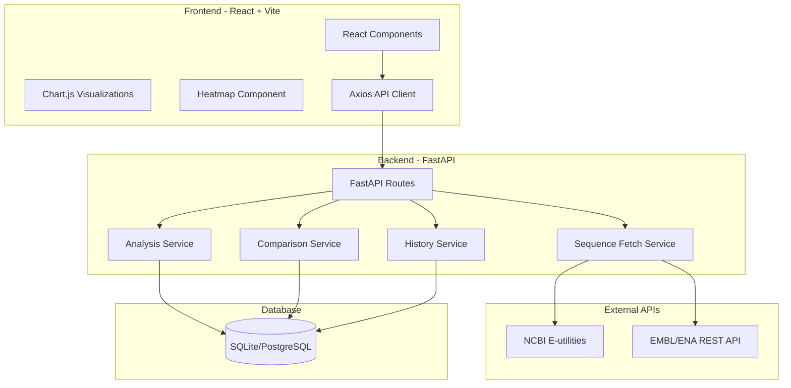
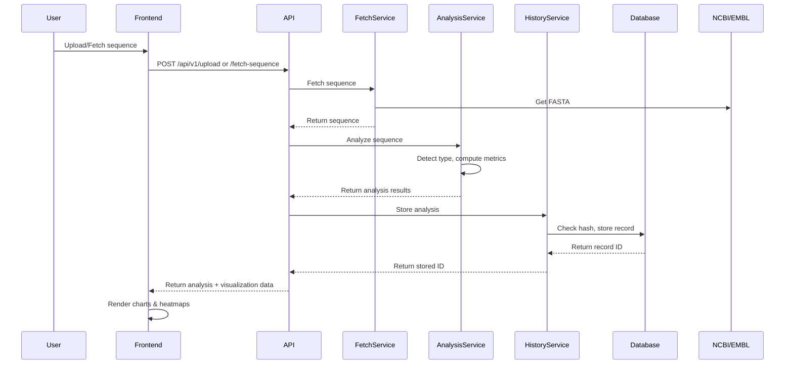

# Genomic Ana

lysis Platform - Implementation Plan

## Architecture Overview

The platform follows a clean separation between backend (FastAPI) and frontend (React), with a centralized database for history/reproducibility.




## Project Structure

```javascript
opengenviz/
├── backend/
│   ├── main.py                 # FastAPI app entry point
│   ├── config.py               # Environment configuration
│   ├── requirements.txt        # Python dependencies
│   ├── api/
│   │   ├── __init__.py
│   │   ├── v1/
│   │   │   ├── __init__.py
│   │   │   ├── routes.py       # API route handlers
│   │   │   └── schemas.py      # Pydantic models
│   ├── services/
│   │   ├── __init__.py
│   │   ├── fetch_service.py    # NCBI/EMBL sequence fetching
│   │   ├── analysis_service.py # Sequence analysis logic
│   │   ├── comparison_service.py # Alignment & mutation detection
│   │   └── history_service.py  # History/reproducibility
│   ├── database/
│   │   ├── __init__.py
│   │   ├── models.py           # SQLAlchemy models
│   │   ├── database.py         # DB connection & session
│   │   └── init_db.py          # Schema initialization
│   └── utils/
│       ├── __init__.py
│       ├── sequence_utils.py   # Sequence parsing/validation
│       └── visualization_data.py # Chart data preparation
├── frontend/
│   ├── package.json
│   ├── vite.config.js
│   ├── index.html
│   ├── src/
│   │   ├── App.jsx             # Main app component
│   │   ├── main.jsx            # React entry point
│   │   ├── api/
│   │   │   └── client.js       # Axios API client
│   │   ├── components/
│   │   │   ├── UploadPanel.jsx
│   │   │   ├── FetchPanel.jsx
│   │   │   ├── AnalysisPanel.jsx
│   │   │   ├── VisualizationPanel.jsx
│   │   │   ├── HeatmapPanel.jsx
│   │   │   ├── SequenceComparison.jsx
│   │   │   ├── HistoryPanel.jsx
│   │   │   ├── HistoryDetail.jsx
│   │   │   └── Disclaimer.jsx
│   │   └── styles/
│   │       └── App.css
└── README.md                   # Comprehensive documentation
```


## Implementation Details

### Backend Implementation

#### 1. Database Schema (`backend/database/models.py`)

**AnalysisRecord** table:

- `id` (primary key)
- `sequence_hash` (SHA256, indexed for deduplication)
- `sequence_type` (DNA/RNA/Protein)
- `source_type` (upload/fetch)
- `source_identifier` (accession/gene name/URL)
- `original_fasta` (text)
- `sequence_length` (integer)
- `metadata_json` (JSON: counts, GC%, AT%, etc.)
- `visualization_data_json` (JSON: chart datasets)
- `created_at` (timestamp)

**ComparisonRecord** table:

- `id` (primary key)
- `reference_analysis_id` (FK to AnalysisRecord)
- `sample_analysis_id` (FK to AnalysisRecord)
- `alignment_data_json` (JSON: alignment result)
- `mutations_json` (JSON: mutation list)
- `mutation_count` (integer)
- `created_at` (timestamp)

#### 2. Sequence Fetch Service (`backend/services/fetch_service.py`)

- **NCBI fetching**: Use `esearch` + `efetch` via Entrez API
- Handle accession numbers (NM_*, XM_*, etc.)
- Handle gene name + species queries
- Retry logic with exponential backoff
- **EMBL/ENA fetching**: REST API calls to `https://www.ebi.ac.uk/ena/browser/api/fasta/{accession}`
- **Direct URL fetching**: Download and parse FASTA from URLs
- Error handling for invalid accessions, network failures, rate limits

#### 3. Sequence Type Detection (`backend/utils/sequence_utils.py`)

- Parse FASTA format (handle multi-line sequences)
- Detect type:
- **DNA**: Contains only A, T, G, C, N (case-insensitive)
- **RNA**: Contains only A, U, G, C, N
- **Protein**: Contains standard amino acid letters (A-Z except B, J, O, U, X, Z with special meaning)
- Return detected type + cleaned sequence

#### 4. Analysis Service (`backend/services/analysis_service.py`)

- **DNA Analysis**:
- Count A, T, G, C, N (case-insensitive)
- Calculate GC% = (G + C) / total × 100
- Calculate AT% = (A + T) / total × 100
- Sliding window GC% (window=50): generate array of GC% values per window
- **RNA Analysis**: Same as DNA but with U instead of T
- **Protein Analysis**: Amino acid composition only (no GC/AT)
- Generate visualization-ready datasets:
- Bar chart data: nucleotide counts
- Pie chart data: GC% vs AT%
- Line chart data: sliding window GC% positions and values
- Heatmap data: GC-density bins across sequence

#### 5. Comparison Service (`backend/services/comparison_service.py`)

- Use Biopython's `PairwiseAligner` (Needleman-Wunsch algorithm)
- Generate global alignment
- Detect mutations:
- **Substitution**: position, ref_base, sample_base
- **Insertion**: position, inserted_sequence
- **Deletion**: position, deleted_sequence
- Generate mutation heatmap data (density per position)
- Return structured mutation list + alignment visualization data

#### 6. History Service (`backend/services/history_service.py`)

- **Store analysis**: Check for duplicate via `sequence_hash`
- If duplicate exists, return existing record ID
- Otherwise, create new record with full data
- **Retrieve analysis**: Fetch by ID with all stored data
- **List history**: Paginated list of all analyses
- **Replay visualization**: Return stored visualization datasets for chart regeneration

#### 7. API Routes (`backend/api/v1/routes.py`)

- `POST /api/v1/upload`: Accept FASTA file upload
- `POST /api/v1/fetch-sequence`: Accept fetch parameters (accession/gene/URL)
- `POST /api/v1/analyze`: Analyze sequence (type detection + metrics)
- `POST /api/v1/compare`: Compare two sequences
- `GET /api/v1/history`: List all analyses (paginated)
- `GET /api/v1/history/{id}`: Get full analysis record
- CORS enabled for frontend
- Error responses with user-friendly messages

#### 8. Pydantic Schemas (`backend/api/v1/schemas.py`)

- `SequenceFetchRequest`: accession/gene_name/species/url
- `AnalysisResponse`: sequence_type, metrics, visualization_data
- `ComparisonRequest`: reference_id, sample_id
- `ComparisonResponse`: mutations, alignment, mutation_count
- `HistoryResponse`: list of analysis summaries
- `HistoryDetailResponse`: full analysis record

### Frontend Implementation

#### 1. API Client (`frontend/src/api/client.js`)

- Axios instance with base URL from environment
- Request/response interceptors
- Error handling with user-friendly messages

#### 2. Main Layout (`frontend/src/App.jsx`)

- Two-column responsive layout:
- **Left**: Input panels, comparison, history
- **Right**: Analysis output, visualizations
- State management for current analysis, comparison, history
- Scientific disclaimer banner (always visible)

#### 3. Input Components

**UploadPanel** (`frontend/src/components/UploadPanel.jsx`):

- File input for FASTA upload
- Drag-and-drop support
- File validation

**FetchPanel** (`frontend/src/components/FetchPanel.jsx`):

- Tabs for: NCBI accession, Gene name, EMBL accession, URL
- Form inputs with validation
- Fetch button with loading state

#### 4. Analysis Components

**AnalysisPanel** (`frontend/src/components/AnalysisPanel.jsx`):

- Display sequence type, length, basic metrics
- Show nucleotide counts table
- Display GC% and AT% prominently

**VisualizationPanel** (`frontend/src/components/VisualizationPanel.jsx`):

- Bar chart (Chart.js): nucleotide counts
- Pie chart (Chart.js): GC% vs AT%
- Line chart (Chart.js): sliding window GC%
- Responsive canvas containers

**HeatmapPanel** (`frontend/src/components/HeatmapPanel.jsx`):

- Use `chartjs-chart-matrix` or custom heatmap
- GC-density heatmap: color gradient (blue→yellow→red)
- Mutation heatmap: overlay on comparison
- Interactive tooltips with position/values

#### 5. Comparison Component

**SequenceComparison** (`frontend/src/components/SequenceComparison.jsx`):

- Reference/sample selection (from history or new upload)
- Alignment viewer: color-coded mismatches
- Mutation list table: position, type, ref, sample
- Mutation statistics
- Mutation heatmap overlay

#### 6. History Components

**HistoryPanel** (`frontend/src/components/HistoryPanel.jsx`):

- List of previous analyses (paginated)
- Display: sequence type, length, source, timestamp
- Click to view details
- Search/filter by type or source

**HistoryDetail** (`frontend/src/components/HistoryDetail.jsx`):

- Full analysis replay:
- Original FASTA
- All metrics
- Regenerated charts from stored data
- Heatmaps from stored data
- "Re-analyze" button to run fresh analysis

#### 7. Disclaimer Component

**Disclaimer** (`frontend/src/components/Disclaimer.jsx`):

- Prominent banner/alert
- Text: "This tool is for educational and research purposes only. It is not intended for clinical or diagnostic use."
- Styled for visibility (warning colors)

### Configuration & Dependencies

#### Backend (`backend/requirements.txt`)

- fastapi
- uvicorn
- biopython
- requests
- pydantic
- sqlalchemy
- python-multipart (for file uploads)

#### Frontend (`frontend/package.json`)

- react
- react-dom
- vite
- axios
- chart.js
- react-chartjs-2
- chartjs-chart-matrix (or alternative heatmap library)

#### Environment Variables

- `DATABASE_URL` (SQLite path for dev, PostgreSQL URL for prod)
- `API_HOST`, `API_PORT`
- `FRONTEND_URL` (for CORS)
- `NCBI_EMAIL` (for E-utilities)

### Data Flow




## Implementation Order

1. **Backend Core**:

- Database models and initialization
- Sequence utilities (parsing, type detection)
- Analysis service
- History service

2. **Backend API**:

- Fetch service (NCBI/EMBL)
- Comparison service
- API routes and schemas
- Error handling

3. **Frontend Foundation**:

- Project setup (Vite + React)
- API client
- Main layout and routing

4. **Frontend Components**:

- Input panels (Upload, Fetch)
- Analysis display
- Visualization components (charts)
- Heatmap component

5. **Frontend Advanced**:

- Comparison viewer
- History browser
- History detail/replay

6. **Polish**:

- Error handling UI
- Loading states
- Responsive design
- Documentation (README.md)

## Key Files to Create

### Backend (15 files)

- `backend/main.py` - FastAPI app
- `backend/config.py` - Configuration
- `backend/requirements.txt` - Dependencies
- `backend/api/v1/routes.py` - API endpoints
- `backend/api/v1/schemas.py` - Pydantic models
- `backend/services/fetch_service.py` - Sequence fetching
- `backend/services/analysis_service.py` - Analysis logic
- `backend/services/comparison_service.py` - Alignment/mutations
- `backend/services/history_service.py` - History management
- `backend/database/models.py` - SQLAlchemy models
- `backend/database/database.py` - DB connection
- `backend/database/init_db.py` - Schema init
- `backend/utils/sequence_utils.py` - Sequence utilities
- `backend/utils/visualization_data.py` - Chart data prep

### Frontend (12 files)

- `frontend/package.json` - Dependencies
- `frontend/vite.config.js` - Vite config
- `frontend/index.html` - HTML entry
- `frontend/src/main.jsx` - React entry
- `frontend/src/App.jsx` - Main component
- `frontend/src/api/client.js` - API client
- `frontend/src/components/UploadPanel.jsx`
- `frontend/src/components/FetchPanel.jsx`
- `frontend/src/components/AnalysisPanel.jsx`
- `frontend/src/components/VisualizationPanel.jsx`
- `frontend/src/components/HeatmapPanel.jsx`
- `frontend/src/components/SequenceComparison.jsx`
- `frontend/src/components/HistoryPanel.jsx`
- `frontend/src/components/HistoryDetail.jsx`
- `frontend/src/components/Disclaimer.jsx`
- `frontend/src/styles/App.css` - Styling

### Documentation

- `README.md` - Comprehensive guide with architecture, features, installation, API docs, examples

## Testing Considerations

- Backend: Unit tests for analysis logic, fetch service error handling
- Frontend: Component rendering tests, API integration tests
- Integration: End-to-end workflow (fetch → analyze → visualize → history)